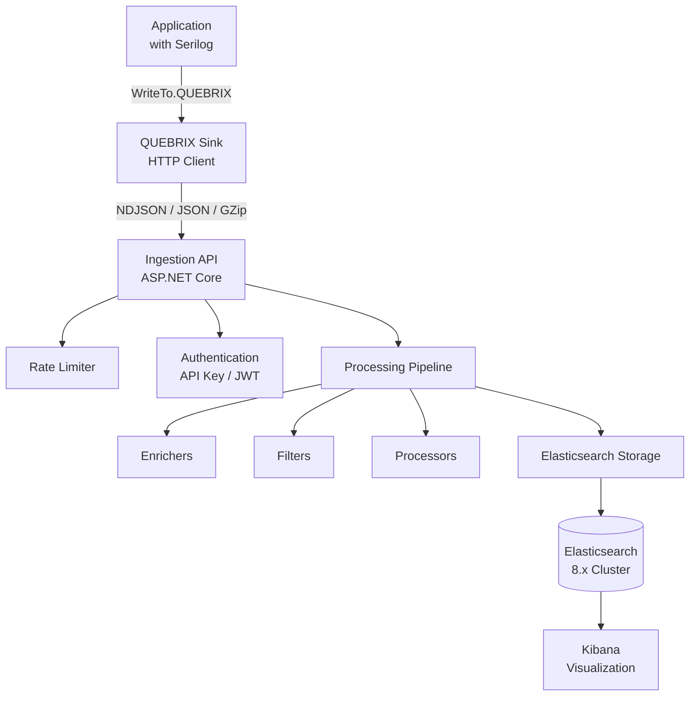
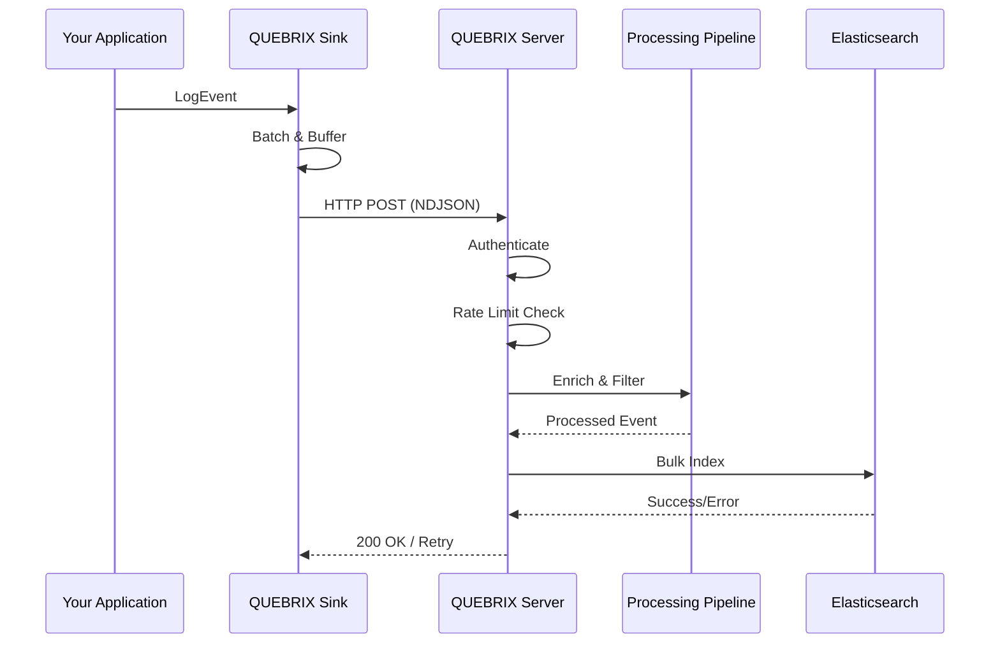
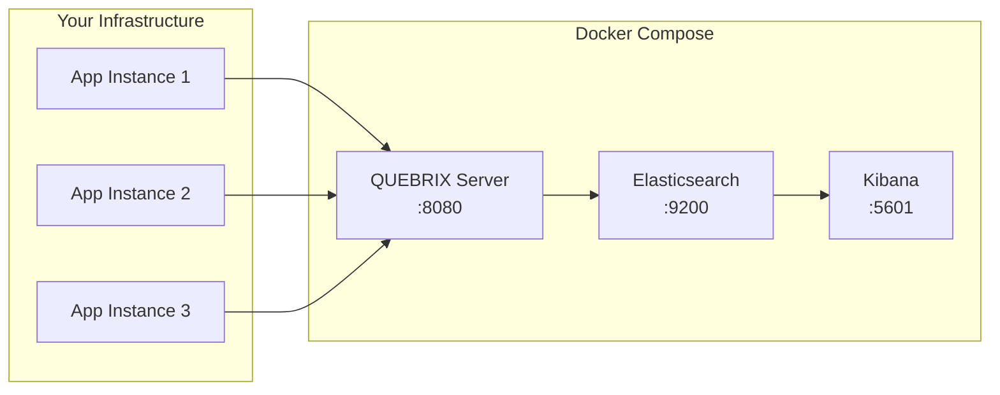

# QUEBRIX Logger

**Enterprise-Grade Logging Platform for .NET 9 — A Modern Replacement for Seq with 100% Serilog Compatibility**

[](https://www.nuget.org/packages/Quebrix.Logger.Sink/)
[](LICENSE)
[](https://dotnet.microsoft.com/download/dotnet/9.0)
[](https://www.elastic.co/elasticsearch/)

---

## Overview

QUEBRIX Logger is a complete, production-ready logging platform designed to replace Seq while maintaining full Serilog compatibility. It provides a centralized log ingestion server with Elasticsearch storage, a drop-in Serilog sink replacement, and enterprise-grade security, performance, and observability.

**Key Features:**
- 🚀 **Drop-in replacement** for `WriteTo.Seq()` → `WriteTo.QUEBRIX()`
- ⚡ **High-performance** async sink with batching, compression, and buffering
- 🔒 **Enterprise security** — API Key, JWT, rate limiting, CORS
- 📊 **Elasticsearch 8.x** storage with ILM, index templates, and dead-letter queues
- 📦 **Full Docker support** with docker-compose (Elasticsearch + Kibana)
- 📈 **OpenTelemetry & Prometheus** metrics integration
- 🔌 **Plugin architecture** — custom enrichers, filters, and processors
- 🧪 **Comprehensive testing** — unit, integration, performance, load tests

---

## Quick Start

### 1. Install the NuGet Package

```bash
dotnet add package QUEBRIX.Logger.Sink
```

### 2. Replace Seq with QUEBRIX

**Before (Seq):**
```csharp
Log.Logger = new LoggerConfiguration()
    .MinimumLevel.Information()
    .WriteTo.Seq("http://localhost:5341")
    .CreateLogger();
```

**After (QUEBRIX):**
```csharp
Log.Logger = new LoggerConfiguration()
    .MinimumLevel.Information()
    .WriteTo.QUEBRIX(options =>
    {
        options.Url = "http://localhost:8080";
        options.ApiKey = "your-api-key";
        options.Application = "Accounting";
        options.Environment = "Production";
    })
    .CreateLogger();
```

### 3. Start the Server

```bash
# Using Docker (recommended)
docker-compose up -d

# Or run directly
dotnet run --project QUEBRIX.Logger.Server
```

---

## Architecture

```
┌─────────────┐     ┌──────────────┐     ┌─────────────────┐     ┌──────────────┐
│  Your App   │────▶│ QUEBRIX Sink │────▶│  Ingestion API  │────▶│ Elasticsearch│
│  (Serilog)  │     │  (HTTP/HTTPS)│     │  (ASP.NET Core) │     │   (8.x)      │
└─────────────┘     └──────────────┘     └─────────────────┘     └──────────────┘
                                               │
                                        ┌──────┴──────┐
                                        │  Processing  │
                                        │   Pipeline   │
                                        │              │
                                        │  ┌────────┐  │
                                        │  │Enrichers│  │
                                        │  ├────────┤  │
                                        │  │ Filters │  │
                                        │  ├────────┤  │
                                        │  │Processrs│  │
                                        │  └────────┘  │
                                        └──────┬──────┘
                                               │
                                        ┌──────┴──────┐
                                        │    Security  │
                                        │  ┌────────┐  │
                                        │  │API Keys │  │
                                        │  │  JWT    │  │
                                        │  │Rate Lmt│  │
                                        │  └────────┘  │
                                        └─────────────┘
```

### Project Structure

```
QUEBRIX.Logger/
├── QUEBRIX.Logger.Common/          # Shared constants, options, and utilities
├── QUEBRIX.Logger.Contracts/        # Log event model and API contracts
├── QUEBRIX.Logger.Storage.Abstractions/  # Storage interface abstractions
├── QUEBRIX.Logger.Storage.Elasticsearch/ # Elasticsearch 8.x implementation
├── QUEBRIX.Logger.Security/         # Authentication, authorization, rate limiting
├── QUEBRIX.Logger.Core/            # Ingestion pipeline, processing, business logic
├── QUEBRIX.Logger.Server/          # ASP.NET Core server host
├── QUEBRIX.Logger.Sink/            # Serilog sink (NuGet package)
├── QUEBRIX.Logger.SDK/             # Programmatic client SDK
├── QUEBRIX.Logger.Tests/           # Unit and integration tests
├── Dockerfile                       # Multi-stage Docker build
├── docker-compose.yml               # Full platform deployment
└── README.md                       # This file
```

---

## Serilog Sink Configuration

### Basic Configuration

```csharp
Log.Logger = new LoggerConfiguration()
    .WriteTo.QUEBRIX(options =>
    {
        options.Url = "http://localhost:8080";
        options.ApiKey = "your-api-key";
    })
    .CreateLogger();
```

### Advanced Configuration

```csharp
Log.Logger = new LoggerConfiguration()
    .MinimumLevel.Information()
    .WriteTo.QUEBRIX(options =>
    {
        // Connection
        options.Url = "http://localhost:8080";
        options.ApiKey = "your-api-key";

        // Metadata
        options.Application = "MyApp";
        options.Environment = "Production";
        options.Tags = new[] { "web", "api" };

        // Batching
        options.BatchSize = 100;
        options.Period = TimeSpan.FromSeconds(2);
        options.QueueSize = 10000;
        options.Timeout = TimeSpan.FromSeconds(10);

        // Compression
        options.UseCompression = true;
        options.MinCompressedSize = 1024;

        // Buffering
        options.UseBuffer = true;
        options.BufferPath = "./logs/buffer";
        options.MaxBufferSize = 100 * 1024 * 1024; // 100 MB

        // Retry
        options.MaxRetries = 3;
        options.RetryDelay = TimeSpan.FromSeconds(1);
        options.ExponentialBackoff = true;

        // Offline mode
        options.OfflineMode = false;
        options.DurableMode = true;
    })
    .CreateLogger();
```

### appsettings.json Configuration

```json
{
  "Serilog": {
    "WriteTo": [
      {
        "Name": "QUEBRIX",
        "Args": {
          "url": "http://localhost:8080",
          "apiKey": "your-api-key",
          "application": "MyApp",
          "environment": "Production",
          "batchSize": 100,
          "period": "00:00:02"
        }
      }
    ]
  }
}
```

### Custom Headers

```csharp
.WriteTo.QUEBRIX(options =>
{
    options.Url = "http://localhost:8080";
    options.CustomHeaders = new Dictionary<string, string>
    {
        ["X-Custom-Tag"] = "production-us-east"
    };
})
```

---

## Server Configuration

### appsettings.json

```json
{
  "Quebrix": {
    "Application": "QUEBRIX Logger",
    "Environment": "Production",
    "ListenUrl": "http://0.0.0.0:8080",
    "IngestionPath": "/ingestion",
    "HealthPath": "/health",
    "MetricsPath": "/metrics",
    "MaxRequestBodySize": 10485760,
    "EnableCors": true,
    "RateLimitPerMinute": 1000,
    "EnableMetrics": true,
    "EnableOpenTelemetry": true,
    "Elasticsearch": {
      "Urls": ["http://localhost:9200"],
      "DefaultIndexPrefix": "quebrix-logs",
      "NumberOfShards": 1,
      "NumberOfReplicas": 0,
      "EnableILM": true,
      "BulkBatchSize": 1000,
      "BulkConcurrency": 4,
      "MaxRetries": 3,
      "RetryDelayMilliseconds": 1000
    },
    "ApiKeys": ["your-api-key-here"]
  }
}
```

### Environment Variables

All settings can be overridden with the `QUEBRIX_` prefix:

```bash
export QUEBRIX_APPLICATION="MyApp"
export QUEBRIX_ENVIRONMENT="Production"
export QUEBRIX_ELASTICSEARCH__URLS__0="http://elasticsearch:9200"
export QUEBRIX_ELASTICSEARCH__DEFAULTINDEXPREFIX="myapp-logs"
```

---

## Docker Deployment

### Quick Start

```bash
# Clone and navigate
git clone https://github.com/your-org/quebrix-logger.git
cd quebrix-logger

# Start all services
docker-compose up -d

# Check health
curl http://localhost:8080/health
```

### Services

| Service | Port | Description |
|---------|------|-------------|
| QUEBRIX Server | 8080 | Log ingestion API |
| Elasticsearch | 9200 | Log storage |
| Kibana | 5601 | Log visualization |

### Environment Variables for Docker

```yaml
services:
  quebrix-server:
    environment:
      - QUEBRIX_APPLICATION=QUEBRIX Logger
      - QUEBRIX_ENVIRONMENT=Production
      - QUEBRIX_LISTENURL=http://0.0.0.0:8080
      - QUEBRIX_ELASTICSEARCH__URLS__0=http://elasticsearch:9200
      - QUEBRIX_ELASTICSEARCH__DEFAULTINDEXPREFIX=quebrix-logs
      - QUEBRIX_ELASTICSEARCH__NUMBEROFSHARDS=1
      - QUEBRIX_ELASTICSEARCH__NUMBEROFREPLICAS=0
      - QUEBRIX_ELASTICSEARCH__ENABLEILM=true
      - QUEBRIX_ELASTICSEARCH__BULKBATCHSIZE=1000
      - QUEBRIX_ELASTICSEARCH__BULKCONCURRENCY=4
      - QUEBRIX_ELASTICSEARCH__MAXRETRIES=3
```

---

## Ingestion API

### POST /ingestion — Single Event

```json
{
  "timestamp": "2026-07-25T12:00:00.000Z",
  "level": "Information",
  "messageTemplate": "User {UserId} logged in from {IpAddress}",
  "renderedMessage": "User 42 logged in from 192.168.1.1",
  "exception": null,
  "properties": {
    "UserId": 42,
    "IpAddress": "192.168.1.1"
  },
  "machineName": "SRV-WEB-01",
  "processId": 1234,
  "threadId": 7,
  "traceId": "abc123...",
  "spanId": "def456...",
  "correlationId": "corr-789",
  "requestId": "req-012",
  "environment": "Production",
  "application": "MyApp",
  "sourceContext": "MyApp.Services.AuthService",
  "eventId": { "id": 1001, "name": "UserLogin" },
  "userId": "user-42",
  "sessionId": "sess-xyz",
  "host": "SRV-WEB-01",
  "tags": ["auth", "login"]
}
```

### POST /ingestion — Batch Events (NDJSON)

```
Content-Type: application/x-ndjson

{"timestamp":"...","level":"Information","messageTemplate":"Event 1","renderedMessage":"Event 1"}
{"timestamp":"...","level":"Warning","messageTemplate":"Event 2","renderedMessage":"Event 2"}
```

### POST /ingestion — Compressed Batch

```
Content-Type: application/json
Content-Encoding: gzip
```

### Response

```json
{
  "success": true,
  "ingestedCount": 100,
  "failedCount": 0,
  "elapsedMs": 45
}
```

---

## Security

### API Key Authentication

```bash
curl -H "X-Api-Key: your-api-key" http://localhost:8080/ingestion
```

### Rate Limiting

Default: 1000 requests/minute per IP. Configurable via `QuebrixServerOptions.RateLimitPerMinute`.

### CORS

Enabled by default with wildcard origin. Configure specific origins:

```json
{
  "Quebrix": {
    "EnableCors": true,
    "CorsOrigins": "https://app1.example.com,https://app2.example.com"
  }
}
```

---

## Performance

- **Async throughout** — no blocking calls
- **ArrayPool/MemoryPool** — zero allocation on hot paths
- **Channel<T>** — producer/consumer buffering
- **System.IO.Pipelines** — streaming ingestion
- **Bulk API** — Elasticsearch bulk operations
- **Connection pooling** — HTTP and Elasticsearch
- **Concurrent batching** — configurable concurrency

---

## Observability

### Health Checks

```
GET /health
```

```json
{
  "status": "Healthy",
  "checks": [
    { "name": "elasticsearch", "status": "Healthy", "duration": 5.2 }
  ]
}
```

### Prometheus Metrics

```
GET /metrics
```

### OpenTelemetry

Automatic instrumentation via `OpenTelemetry.Instrumentation.AspNetCore` with distributed tracing and metrics.

---

## Log Event Model

| Property | Type | Description |
|----------|------|-------------|
| `Timestamp` | DateTime | Log event timestamp |
| `Level` | string | Log level (Verbose, Debug, Information, Warning, Error, Fatal) |
| `MessageTemplate` | string | Serilog message template |
| `RenderedMessage` | string | Formatted log message |
| `Exception` | string | Exception details |
| `Properties` | Dictionary | Structured log properties |
| `MachineName` | string | Machine name |
| `ProcessId` | int | Process ID |
| `ThreadId` | int | Thread ID |
| `TraceId` | string | OpenTelemetry trace ID |
| `SpanId` | string | OpenTelemetry span ID |
| `CorrelationId` | string | Correlation ID |
| `RequestId` | string | Request ID |
| `Environment` | string | Deployment environment |
| `Application` | string | Application name |
| `SourceContext` | string | Logger source context |
| `EventId` | EventId | Serilog event ID |
| `UserId` | string | User identifier |
| `SessionId` | string | Session identifier |
| `Host` | string | Host name |
| `Tags` | string[] | Custom tags |

---

## Building from Source

```bash
# Clone
git clone https://github.com/your-org/quebrix-logger.git
cd quebrix-logger

# Restore and build
dotnet restore
dotnet build

# Run tests
dotnet test

# Create NuGet package
dotnet pack QUEBRIX.Logger.Sink -c Release -o ./nupkg

# Run server
dotnet run --project QUEBRIX.Logger.Server
```

---

## NuGet Package

### Package Details

- **Package ID:** QUEBRIX.Logger.Sink
- **License:** MIT
- **Tags:** serilog, sink, logging, elasticsearch, quebrix, seq-replacement
- **Source Link:** Enabled
- **Symbols:** Embedded in .snupkg

### Publish

```bash
dotnet pack QUEBRIX.Logger.Sink -c Release -o ./nupkg
dotnet nuget push ./nupkg/QUEBRIX.Logger.Sink.*.nupkg --source https://api.nuget.org/v3/index.json --api-key your-api-key
```

---

## License

MIT License — see [LICENSE](LICENSE) for details.

---

## Contributing

Contributions are welcome! Please read our [contributing guidelines](CONTRIBUTING.md) and submit a pull request.

---

## Architecture Diagrams

### System Architecture



### Data Flow



### Deployment Architecture



---

## Roadmap

- [x] Serilog sink with full Serilog compatibility
- [x] Elasticsearch 8.x storage with ILM
- [x] Docker deployment with docker-compose
- [x] API key and JWT authentication
- [x] Rate limiting and CORS
- [x] OpenTelemetry and Prometheus metrics
- [x] Batch processing, compression, retries
- [x] Health checks and monitoring
- [ ] Web UI for log exploration and dashboards
- [ ] Alerting and notification system
- [ ] Multi-tenancy support
- [ ] Log retention policies via UI
- [ ] Advanced search and query builder
- [ ] SAML/SSO authentication
- [ ] Audit logging

---

## Support

- 📖 [Documentation](https://quebrix.dev/docs)
- 🐛 [Issue Tracker](https://github.com/your-org/quebrix-logger/issues)
- 💬 [Discord Community](https://discord.gg/quebrix)

---

*QUEBRIX Logger — Enterprise Logging, Simplified.*